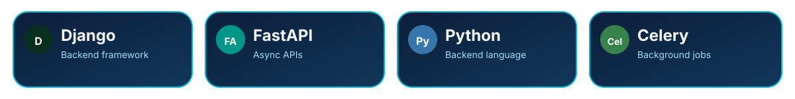
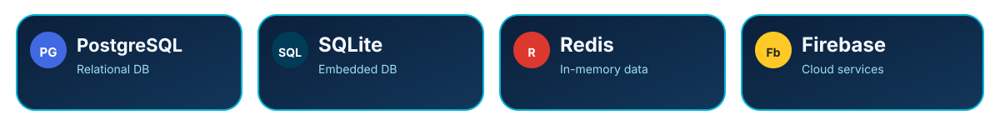
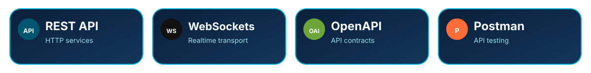
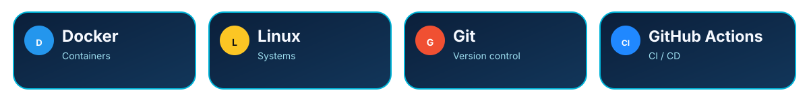

  
  
  

---

## 🧭 Engineering Profile

## 🧠 About Me

I build production-grade software across **mobile, web, backend, and automation platforms**.

My engineering focus is on turning product requirements into software that is **maintainable, scalable, observable, and designed for long-term evolution**.

I care about clean boundaries, dependable APIs, realtime communication, developer experience, and systems that remain understandable as they grow.

---

## 🛠 My Skills

### Languages

### Mobile Development

### Backend

### Frontend

### Databases & Data

### Realtime, APIs & Integration

### DevOps & Infrastructure

### Testing & Quality

### Development Tools

### Architecture & Engineering

`Clean Architecture` · `Distributed Systems` · `Microservices` · `Realtime Systems` · `Event-Driven Architecture`

`REST APIs` · `WebSockets` · `Background Jobs` · `Workflow Automation` · `API Integration`

---

## 🚀 Featured Work

### `awesome_gauges`
A Flutter package for customizable **curve, horizontal, and vertical gauge components**.

`Flutter` · `Dart` · `Reusable UI Components` · `Package Development`

---

## 🎯 Current Technology Focus

  

`Flutter` × `Python` × `Django` × `FastAPI` × `Next.js` × `TypeScript` × `PostgreSQL` × `Redis`

---

## 🐍 Contribution Snake

<picture>
  <source media="(prefers-color-scheme: dark)" srcset="./assets/github-snake-dark.svg" />
  <source media="(prefers-color-scheme: light)" srcset="./assets/github-snake.svg" />
  
</picture>

---

## ⚙️ GitHub Analytics

  
  

---

## 🛠️ Engineering Principles

| Principle | What it means |
|:--|:--|
| **Architecture first** | Clear boundaries and explicit responsibilities |
| **API first** | Stable contracts between systems and clients |
| **Scalability** | Design for growth without unnecessary complexity |
| **Observability** | Systems should be diagnosable in production |
| **Automation** | Repetitive work should become reliable workflows |
| **Maintainability** | Code should remain understandable months later |

---

## 🤝 Let's Connect

 

 
